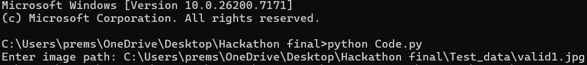

# Cow Weight Detection

This project estimates the **body length**, **heart girth**, and **weight of a cow** using:

- Roboflow Keypoint Detection API  
- A machine learning scale model (`scale_model.pkl`)  
- Image compression for optimized upload  
- Geometric measurement formulas  

The script uploads a cow image → receives keypoints → computes real-world measurements → predicts weight.

---

## Features

- 📌 In-memory image compression  
- 📌 Automatic keypoint extraction using Roboflow  
- 📌 Measurement calculation using Euclidean distance  
- 📌 Ramanujan elliptical girth approximation  
- 📌 ML-based scale factor prediction  
- 📌 Final cow weight estimation  

---

## Working

1. You provide an image path.  
2. The image is compressed if it exceeds 2 MB.  
3. The image is sent to Roboflow for detection.  
4. Keypoints (Shoulder1, Tail-base, Withers, Shoulder2) are extracted.  
5. Pixel distances → converted to inches using ML scale model.  
6. Measurements → Body Length, Heart Girth.  
7. Weight formula is applied.

---
# Setup

## Step-1️: Clone the GitHub Repository

Use the following command to clone your project:

```bash
git clone https://github.com/Premsainadh/Hackathon
```
## Step-2: Change Directory and install requirements

Use the following command to Change Directory and install requirements:
```bash
cd Hackathon
pip install -r requirements.txt
```
## Step-3: Run the Program

Use the following command to Run the Program:
```bash
python app.py
```
## Step-4: Input image path Format


